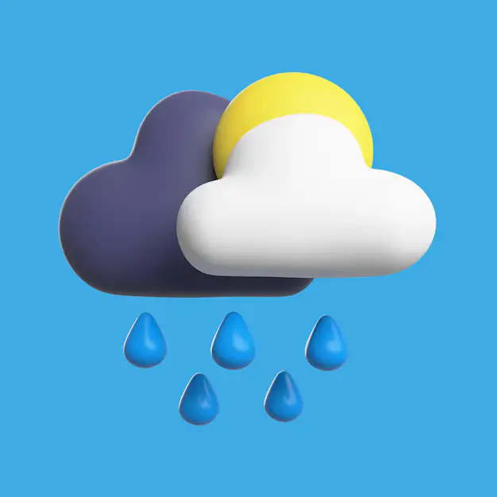
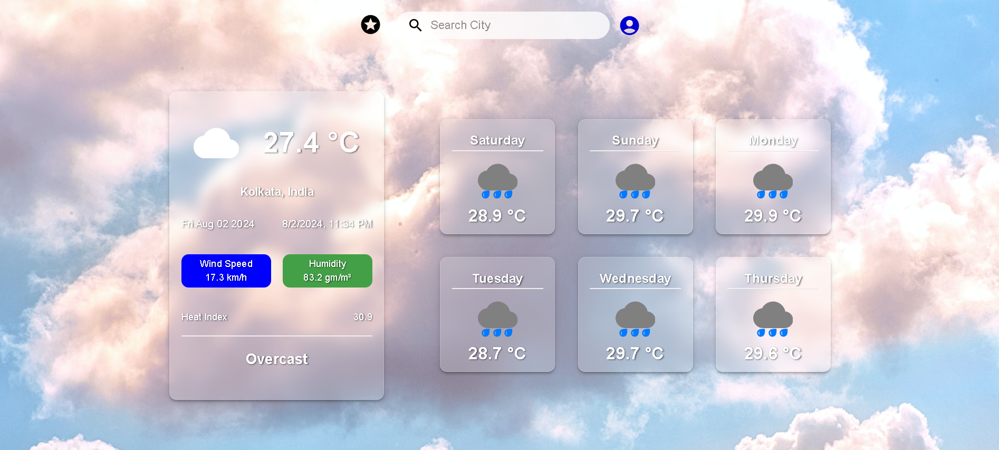

<div id="top"></div>

<!-- PROJECT LOGO -->

<br />
<div align="center">
  <a >
    
  </a>
  <br/>
  <h3 style="font-weight: 600" align="center">Weather App</h3>

  <p align="center">
    Check Weather of Anytime Anywhere
    <br />
    <a href="https://weather-app-frontend.vercel.app/">Live Website</a>
    ·
    <a href=https://github.com/PremSingh24/Weather-App/issues/new">Report Bug</a>
    ·
    <a href="https://github.com/PremSingh24/Weather-App/issues/new">Request Feature</a>
  </p>
</div>

<!-- TABLE OF CONTENTS -->

<details style="margin: 1rem 0">
  <summary>Table of Contents</summary>
  <ol>
    <li>
      <a href="#about-the-project">About The Project</a>
    </li>
      <li><a href="#built-with">Built With</a></li>
    <li>
      <a href="#features">Features</a>
    </li>
    <li><a href="#how-to-use">How To Use</a></li>
    <li><a href="#folder-structure">Folder Structure</a></li>
    <li><a href="#contributing">Contributing</a></li>
    <li><a href="#contact">Contact</a></li>
  </ol>
</details>

<!-- ABOUT THE PROJECT -->

## About The Project



A sleek and modern weather application with a blue-themed, glassmorphic design. Get real-time weather updates with beautiful visuals and intuitive charts.

<p align="right">(<a href="#top">back to top</a>)</p>

<!-- Built With -->

## Built With

Frontend

- [React JS](https://reactjs.org/)
- [Material UI](https://mui.com/material-ui/)
- [Chart JS](https://www.chartjs.org/)

Backend

- [Express Js](https://expressjs.com/)
- [Mongoose](https://mongoosejs.com/)
- [JWT](https://jwt.io/)

<p align="right">(<a href="#top">back to top</a>)</p>

<!-- Features -->

## Features

- User Authentication
  - Login.
  - Signup.
  - Logout.
- Search City
  - Search any city with the search suggestion.
- Save City
  - Add/Remove city to fav City list

<p align="right">(<a href="#top">back to top</a>)</p>

<!-- How To Use -->

## How To Use

1.  Visit [Weather App]() and search for any city you like in the search box.

2.  all city list will appear according to your input, then select any city to view its weather.

3.  You can also save city to your fav city list by logging in.

4.  navigate to the login/register page to login or create a new account.

<p align="right">(<a href="#top">back to top</a>)</p>

<!-- Folder Structure -->

## Folder Structure

```
- /weather app
   - /express-server
        - /src
            - /controllers
            - /database
            - /middleware
            - /models
            - /routes
            - index.js
            - package.json
            - package-lock.json
   - /react-frontend
        - /public
        - /src
            - /api
            - /assets
            - /components
            - /context
            - /hooks
            - /pages
            - /services
            - /utils
            - /App.js
            - /index.js
            - package.json
            - tsconfig.json
- .gitignore
- README.md

```

<p align="right">(<a href="#top">back to top</a>)</p>

<!-- CONTRIBUTING -->

## Contributing

Contributions are what make the open source community such an amazing place to learn, inspire, and create. Any contributions you make are **greatly appreciated**.

1. Fork the Project
2. Create your Feature Branch
3. Commit your Changes
4. Push to the Branch
5. Open a Pull Request

<p align="right">(<a href="#top">back to top</a>)</p>

<!-- CONTACT -->

## Contact

- Email - [PremSingh.Official29@gmail.com](mailto:premsingh.official29@gmail.com)
- Linkedin - [@PremSingh](https://www.linkedin.com/in/prem-singh29/)

<p align="right">(<a href="#top">back to top</a>)</p>
